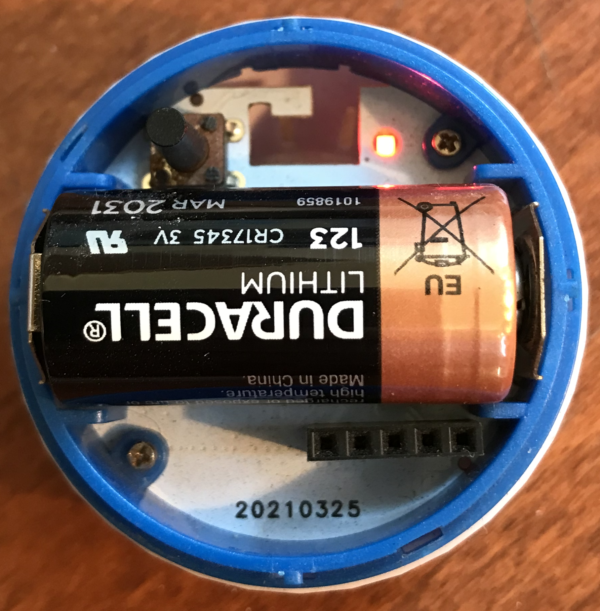

# Out of the box

## Inventory
The box contains the following items:

+ The hub with RaspberryPi4 and micro-SD (uSD) card inserted
+ One (1) USB-C power-adapter (USA 120V)
+ One (1) USB-C to USB-C cord 
+ One (1) 10ft Ethernet cable 
+ One (1) USB to micro-USB cable to charge the motion detectors
+ Two (2) Shelly [motion detectors](https://shelly.cloud/shelly-motion-smart-home-automation-sensor/)
+ One (1) Shelly [humditity and temperature (H&T)](https://shelly.cloud/products/shelly-humidity-temperature-smart-home-automation-sensor/) sensor
+ One (1) Shelly [moisture](https://shelly.cloud/products/shelly-flood-smart-home-automation-sensor/) sensor
+ One (1) Shelly [gas](https://shelly.cloud/products/shelly-gas-smart-home-automation-sensor/) sensor
+ Three (3) Lithium-Ion batteries; 1 for H&T, 1 for Flood; 1 spare
+ Two (2) pair (4 total) Command(tm) adhesive strips for motion sensors

# Installation
There are seven (5) steps:

1. Setup sensors
2. Setup hub
3. Install smartphone app
4. Install Age@Home
5. Integrate sensors

## 1. Setup sensors

**Install the [Shelly](http://shelly.cloud) app** for Apple [iOS](https://apps.apple.com/us/app/shelly-cloud) or Google [Android](https://play.google.com/store/apps/details?id=allterco.bg.shelly).

**Note**: The Shelly Motion sensors may require charging before they can be added to the Wifi network, etc.  The USB to micro-USB cable provided may be plugged into any standard charger for smartphone, .. or may be plugged into the rear of the hub.  USB ports closest to the Ethernet port are USB-3 and should have power.

The Shelly Flood and H&T sensors require batteries (included); refer to the device documentation, but the flood sensor opens with a slight counter-clockwise turn between the top and bottom; it is similar for the H&T sensor.  Both sensors have small buttons to enable, for example if the sensor goes to sleep.

<table width="90%">
<tr><th>H&T</th><th>Flood</th></tr>
<tr><td></td>
<td></td></tr>
</table>

The spare battery may be required for the H&T sensor which appears to draw more energy than anticipated (or documented).

All Shelly sensors are “included” to the Wifi network using the Shelly app on your smartphone.  Refer to the Shelly documentation.

<table width="90%">
<tr><th>Settings</th><th>Hidden</th></tr>
<tr><td></td><td></td></tr>
</table>

## 2. Setup Hub

1. Remove hub from box and remove wrapping
3. Remove power-supply from box and remove wrapping; insert one end of USB-C cable into power-supply
4. Insert Ethernet cable into rear of hub
5. Insert other end of ethernet cable into switch or router.
6. Plug-in power-supply to 120V socket
7. Plug other end of USB-C cable into rear of enclosure
8. Press hub power-on button on rear of enclosure

Wait for approximately 20 minutes until the system is ready (see below).  The [hub](http://homeassistant.local:8123/) displays a waiting page until it has completed download and setup of all the Home Assistant components. Refer to the [installation guide](https://github.com/ageathome/core/blob/main/docs/HOMEASSISTANT.md).

<table width="90%">
<tr><th>Waiting</th><th>Ready</th></tr>
<tr><td></td><td></td></tr>
</table>

## 3. Install Home-Assistant app

**Install the [Home Assistant](http://home-assistant.io) app** for Apple [iOS](https://apps.apple.com/us/app/home-assistant) or Google [Android](https://play.google.com/store/apps/details?id=io.homeassistant.companion.android).

Launch the Home Assistant app on your smartphone; wait for the system to scan for the hub. Manual configuration may be specified as [http://homeassistant.local:8123/](http://homeassistant.local:8123).

<table width="90%">
<tr><th>Welcome</th><th>Scanning</th><th>Manual</th></tr>
<tr>
<td></td>
<td></td>
<td></td>
</tr>
</table>

**Note**: If you have previously installed the smartphone app, select the orange gear in the lower right corner when the app starts; then select the Debug option at the end and select Reset.

When the app starts (or has been reset), it will search the network for the hub; by default the hub is named “homeassistant” on the local network, e.g. [http://homeassistant.local:8123/](http://homeassistant.local:8123/) is the default Web address (n.b. 8123 is the port number).

After the app has scanned the network and found your local hub you will be able to configure the app to access the smartphone information as well as enable notifications and then create the Owner account (i.e. “independent adult”) by providing a name (e.g. “David Martin”) and then a password if the automated default login name is acceptable.

Once these steps are complete you should be able to access the basic installation of Home-Assistant on the local network using the Owner account, i.e login name and password.

The Owner account should be customized to enable “Advanced Mode” — this mode enables specifying automatics updates; customizations are accessed through the last panel item which should be the Owner name (e.g. “David Martin” with default icon of “DM”).

## 4. Install Age@Home

The Age@Home software is packaged as Docker container available through the Home-Assistant [Add-on Store](http://homeassistant.local/hassio/store); please refer to [quick start instructions](https://github.com/ageathome/core/blob/main/docs/QUICKSTART.md)

## 5. Integrate Sensors

Once the sensors have been added to network they may then be [integrated](http://homeassistant.local:8123/config/integrations) into Home-Assistant and made available to Age@Home in the following device classes:

<table width="90%">
<tr>
<td>battery</td>
<td>connectivity</td>
<td>current</td>
</tr>
<tr>
<td>door</td>
<td>energy</td>
<td>gas</td>
</tr>
<tr>
<td>humidity</td>
<td>illuminance</td>
<td>light</td>
</tr>
<tr>
<td>moisture</td>
<td>motion</td>
<td>occupancy</td>
</tr>
<tr>
<td>opening</td>
<td>plug</td>
<td>power</td>
</tr>
<tr>
<td>presence</td>
<td>problem</td>
<td>safety</td>
</tr>
<tr>
<td>smoke</td>
<td>tamper</td>
<td>temperature</td>
</tr>
<tr>
<td>update</td>
<td>vibration</td>
<td>voltage</td>
</tr>
</table>

Select the Settings panel item and then Devices & Services from the available settings.  Select the discovered Shelly sensors or select the Add Integration button and then enter “Shelly” which should display any discovered Shelly sensors.

If the H&T or Flood (aka “moisture”) sensors are not found the small button inside should be pushed to wake-up the sensor; a small red light will flash on the sensor when it is awake.  Repeating the Add Integration step may be required.

Similarly, the Motion sensor may require awakening; it has two small holes on the bottom on either side of the micro-USB port — there is a rubber cover for this area which may need to be removed; one hole provides a light and the other a recessed switch which may be depressed using a pin or paperclip.

Pressing the Shelly Motion recessed button one time will wake it up; 5 times will make it reboot; and 15 times will reset to factory (IIRC, check included sensor manual).

Once devices have been integrated into the system they may be placed in appropriate locations; it is recommended to awaken each sensor in its desired area prior to final installation, e.g. single press of recenssed button on motion sensor prior to attaching to wall.
